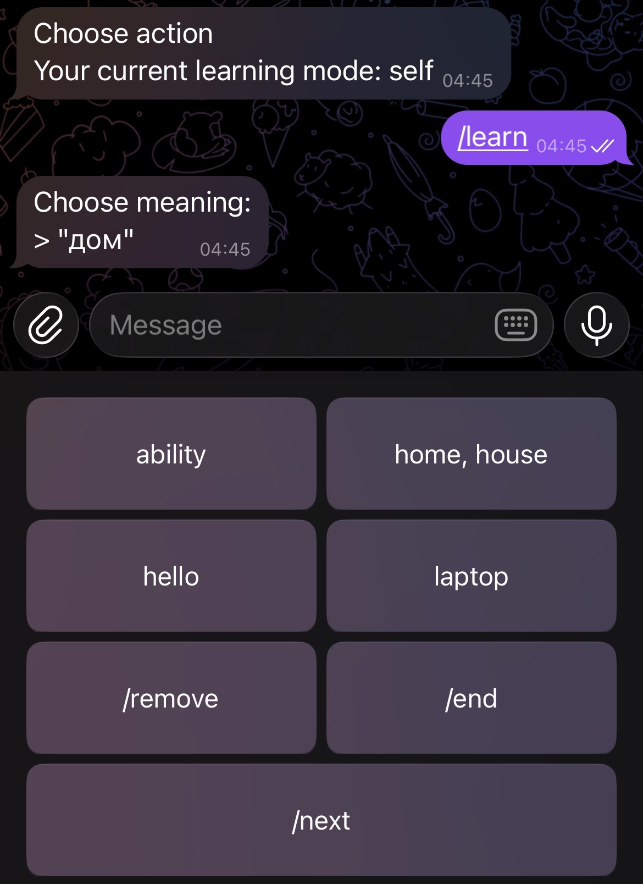
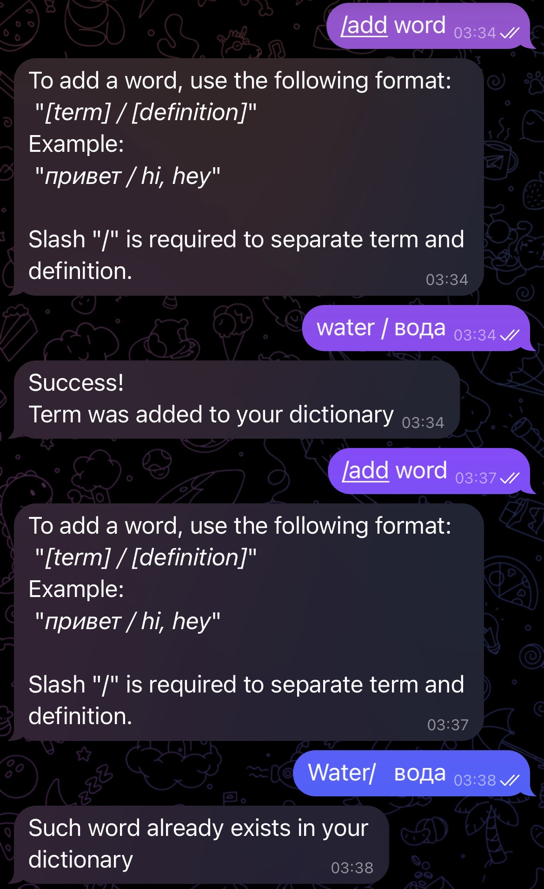

# Telegram Bot for terms learning

This bot uses a dictionary to create shuffled sets of word cards to learn. This repository uses reworked [Badestrand](https://github.com/Badestrand)'s [Russian Dictionary Data](https://github.com/Badestrand/russian-dictionary). The dictionary is loaded into a PostgreSQL database named telegram_terming_bot_db, which should be created to run this bot (the tables are created automatically). The program provides options as adding custom terms and removing a word (affects only the user's dictionary).

You may experience using the bot [here](https://t.me/d13english_bot).

## Starting
At first launch, the program asks for the Telegram bot token and database credentials. If all is past, then the program asks if the signing data should be saved. If yes, then the data is saved to the .env file in the [data](data) folder.

The tables are created automatically in the database. The dictionary is loaded from the [rus_eng_dict.csv](data/rus_eng_dict.csv) file, which might be modified, but must be existing and have the same structure. 

## Commands

### /start
From a first interaction, the program adds the user's *Telegram ID* to the database, the bot sends a greeting message, and showing menu of cards of commands: __/learn__ and __/add word__.

### /add word
The bot asks for the word and its meaning in Russian and English. The word is saved to the database and will be shown in the next learning session.

### /learn
The bot sends a message with a word and shows cards with options (meanings) to choose from, allowing the user to choose the correct meaning of the word. Also, cards with commands are shown: __/remove__, __/end__  and __/next__.

### /remove
The program removes just shown word from the user's dictionary.

### /next
The program sends the next word to learn. Might be used as a "skip" option.

### /end
The learning session is ends, and the user is returned to the menu.

### /switch mode*
Switch the user's learning mode between "full" (full) and "only user's words" (self).

\*This option appears in main menu only if the user have added enough words, which is the same amount as cards in set.

## Database's scheme:

## Usage example screenshots

### Learning:

### Adding a word:

## Planned features and improvements 
- One tool/program for:
  -  controlling the program's configuration
  -  changing the dictionary
  -  changing the bot's scripted phrases without editing the code, and a need to restart the bot
  -  adding admin privileges to users
-  In-chat bot's configuration and control for users with admin privileges
- Advencing the learning process with:
  -  algorithmic understanding of user's learning progress, delaying and removing learned words automatically
-  Robust errors handling
-  Shifting to a general Term-Definitional concept of the program, untying from only English-Russian teacher
### Bigger plans
- Shifting to Django 
